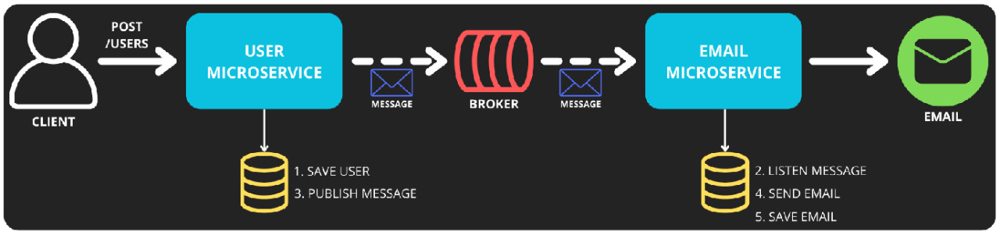

# Java Microservice

## Description
This project is a simple example of microservices using Java, Spring Boot, RabbitMQ, PostgreSQL and Gmail.

## Communication

## Technologies
- Java;
- Maven;
- Spring:
    - Spring Boot;
    - Spring Web;
    - Spring Data JPA;
    - Spring Validation;
    - Spring AMQP;
    - Spring Mail;
- PostgreSQL;
- RabbitMQ;
- Cloud AMQP;
- SMTP Gmail;
